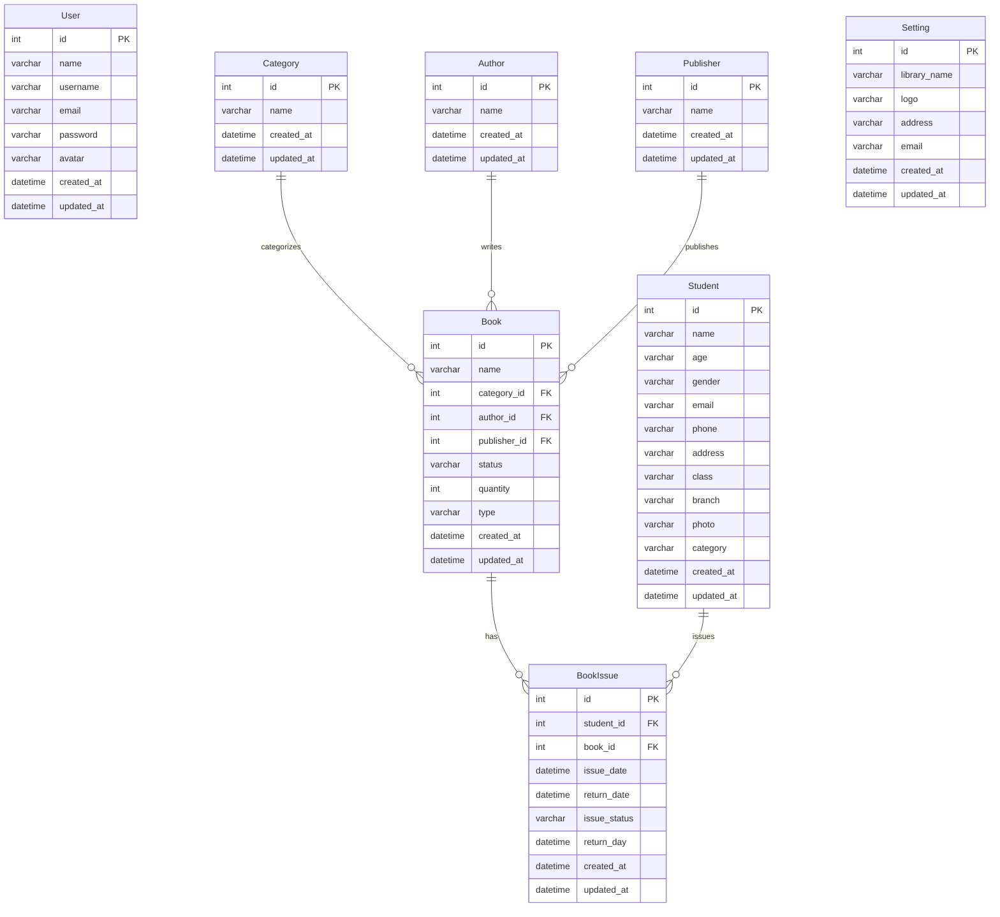
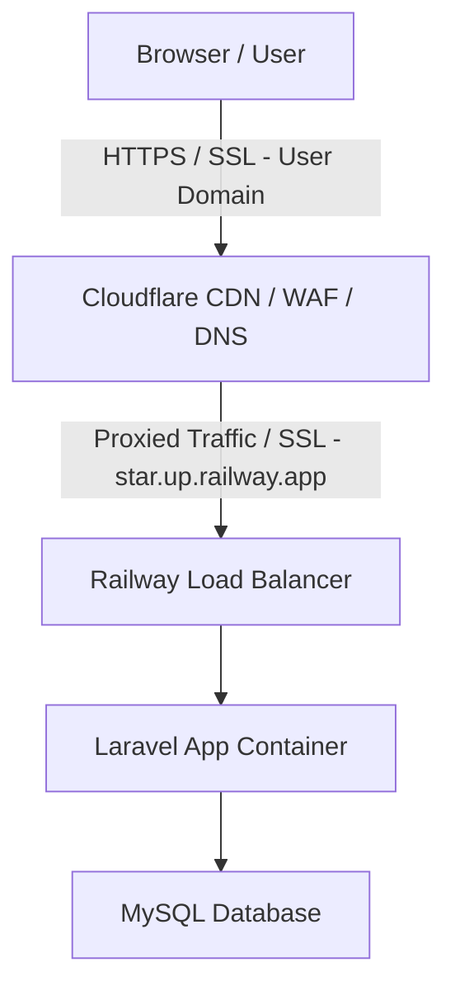

<p align="center">
  <a href="https://laravel.com" target="_blank">
    
  </a>
</p>

# Library Management System

A feature-rich, modern web application designed for school, college, and community libraries. Built using **Laravel 8**, **Livewire**, and **Bootstrap**, this application provides a sleek admin interface to manage books, authors, publishers, students, and book issuances with ease.

[](https://www.php.net/)
[](https://laravel.com)
[](https://laravel-livewire.com)
[](https://opensource.org/licenses/MIT)

---

## Key Features

- 📊 **Dynamic Dashboard**: Real-time stats on total books, active issuances, publishers, and authors.
- 📚 **Book Cataloging**: Manage books, quantities, custom types, and search books dynamically.
- 🧑‍🎓 **Student Management**: Register students with branch, category, contact information, and profile photo upload.
- 📝 **Book Issuance & Tracking**: Record when books are issued and returned, track due dates, and manage late returns.
- 📝 **Dynamic Filtering & Livewire**: Real-time searching and pagination across all lists without page reloads.
- 📈 **Detailed Reports**: Generate daily, monthly, and overdue reports in a clean tabular view.
- ⚙️ **System Settings**: Customize the library name, logo, address, and email settings.

---

## Getting Started (Local Development)

Follow these steps to set up the project locally:

### Prerequisites
- PHP (>= 7.3 or 8.x)
- Composer
- Node.js & NPM
- MySQL Server

### Installation Steps

1. **Clone the Repository**
   ```bash
   git clone https://github.com/mrlvuruk-stack/library.git
   cd library
   ```

2. **Install PHP Dependencies**
   ```bash
   composer install
   ```

3. **Install Frontend Assets**
   ```bash
   npm install
   ```

4. **Compile Assets**
   ```bash
   npm run dev
   ```

5. **Configure Environment File**
   Copy the example environment file and configure your database details:
   - *Windows (PowerShell):*
     ```powershell
     copy .env.example .env
     ```
   - *Linux/macOS:*
     ```bash
     cp .env.example .env
     ```
   Open `.env` and set your `DB_DATABASE`, `DB_USERNAME`, and `DB_PASSWORD`.

6. **Generate Application Key**
   ```bash
   php artisan key:generate
   ```

7. **Migrate and Seed Database**
   Run the migrations and seed default data (creates admin login):
   ```bash
   php artisan migrate:fresh --seed
   ```

8. **Start Local Development Server**
   ```bash
   php artisan serve
   ```
   The application will be accessible at `http://127.0.0.1:8000`.

---

## Default Admin Credentials

Use the following details to log in to the dashboard:
- **Username**: `mrlv`
- **Password**: `password`

---

## Deployment (Railway & Cloudflare)

This project is configured to easily deploy to **Railway** (using a MySQL service) and proxy through **Cloudflare** for DNS, SSL encryption, and caching.

For step-by-step setup guides, refer to:
- Codebase Proxy configuration inside `app/Http/Middleware/TrustProxies.php`.
- SSL security set to **Full** or **Full (strict)** in your Cloudflare panel.

---

## Database Schema (ERD)

Below is the entity-relationship diagram representing the database design of the Library Management System:



---

## Deployment & System Architecture

Here is the operational architecture diagram showing the data flow from clients through Cloudflare and Railway to the Laravel application container and MySQL:



---

## License

This project is open-source software licensed under the [MIT License](LICENSE).
